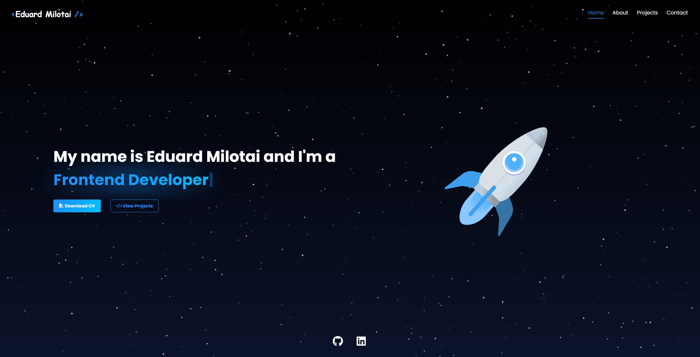

# 🚀 Eduard Milotai - Developer Portfolio

Welcome to my personal **developer portfolio**! This project serves as a showcase of my skills, experience, and the projects I’ve worked on.

🔗 **Live Demo**: [eduardmilotai.vercel.app](https://eduardmilotai.vercel.app)

## 🖼️ Homepage Preview

## ✨ Features

✔️ **Modern & Responsive Design** – Built with Material UI for a sleek and professional look.  
✔️ **Dynamic & Interactive** – Developed using React for a smooth user experience.  
✔️ **Project Showcase** – A collection of my best work with descriptions and links.  
✔️ **Firebase Integration** – Using Firebase for database integration.  
✔️ **Performance Optimized** – Fast, responsive, and mobile-friendly.

## 🛠️ Tech Stack

- ⚛ **React** – Component-based architecture for a seamless UI.
- 🎨 **Material UI** – Beautiful, responsive, and accessible UI components.
- 🔥 **Firebase** – Database integration.
- 🚀 **Vercel** – Fast and reliable deployment platform.

## 📩 Contact

If you’d like to connect, feel free to reach out:

- **Portfolio:** [eduardmilotai.vercel.app](https://eduardmilotai.vercel.app)
- **GitHub:** [github.com/MilotaiEduard](https://github.com/MilotaiEduard)
- **LinkedIn:** [linkedin.com/in/eduardmilotai](https://www.linkedin.com/in/eduardmilotai/)
